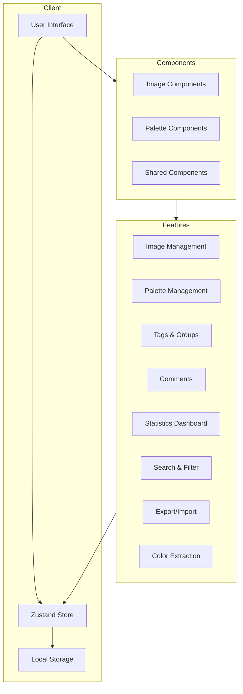
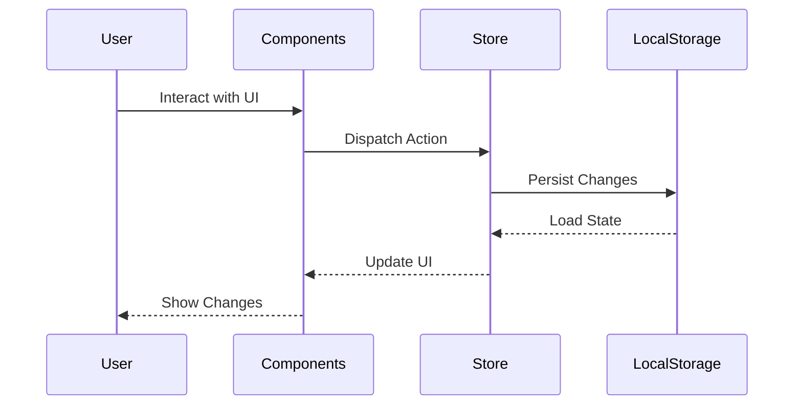

# Palette Project - System Design Document

## 1. Architecture Overview

The Palette Project is built using a modern, component-based architecture with Next.js 14 and React. The application follows a client-side state management approach using Zustand, with persistent storage in the browser's localStorage.

### 1.1 Architecture Diagram



### 1.2 Data Flow



## 2. Component Architecture

### 2.1 Core Components

#### Images Module

- `ImagesModule`: Main container for image management
- `ImageCard`: Display individual images with actions
- `ImageGrid`: Grid layout for images with filtering
- `AddImageForm`: Form for adding new images

#### Palettes Module

- `PalettesModule`: Main container for palette management
- `PaletteCard`: Display individual palettes
- `PaletteGrid`: Grid layout for palettes
- `AddPaletteForm`: Form for creating new palettes

#### Shared Components

- `CommentSection`: Reusable comment functionality
- `Navigation`: App-wide navigation
- `Footer`: App-wide footer
- UI Components (Button, Card, Dialog, etc.)

#### Statistics Dashboard

- `StatsDashboard`: Displays usage statistics and analytics
- `StatCard`: Individual statistic display
- `PopularTags`: Shows most used tags
- `PopularGroups`: Shows most used groups

#### Search & Filter

- `SearchBar`: Global search functionality
- `TagManager`: Tag creation and management
- `GroupManager`: Group creation and management
- `FilterPanel`: Advanced filtering options

### 2.2 Component Responsibilities

#### Image Management

- Image upload and URL handling
- Color extraction from images
- Image metadata management
- Grouping and tagging
- Comments and favorites

#### Palette Management

- Color palette creation
- Color selection and preview
- Palette organization
- Sharing and export options
- Favorites management

#### Shared Features

- Comment system
- Tags and groups management
- Search and filtering
- Sorting and view modes

#### Statistics Dashboard

- Displays usage statistics and analytics
- Individual statistic display
- Most used tags
- Most used groups

#### Search & Filter

- Global search functionality
- Tag creation and management
- Group creation and management
- Advanced filtering options

## 3. State Management

### 3.1 Zustand Store Structure

```typescript
interface AppState {
  // Images
  images: ImageProps[];
  viewMode: "grid" | "list";
  sortBy: "newest" | "oldest" | "name";

  // Palettes
  palettes: ColorPaletteProps[];

  // Organization
  groups: GroupProps[];
  tags: TagProps[];

  // Comments
  comments: CommentProps[];

  // UI State
  showAddImageDialog: boolean;

  // Search & Filter
  searchQuery: string;
  selectedTags: string[];
  selectedGroups: string[];
}
```

### 3.2 Data Persistence

- Uses Zustand persist middleware
- Stores data in localStorage
- Handles date serialization/deserialization
- Maintains data structure integrity

## 4. Technical Decisions

### 4.1 Technology Stack

- **Next.js 14**: For server-side rendering and routing
- **React**: For component-based UI development
- **TypeScript**: For type safety and better developer experience
- **Zustand**: For lightweight state management
- **Tailwind CSS**: For utility-first styling
- **Shadcn/ui**: For consistent UI components
- **ColorThief**: For color extraction from images

### 4.2 Design Patterns

- Component Composition
- Render Props Pattern
- Custom Hooks
- Event Delegation
- Controlled Components

### 4.3 Performance Considerations

- Lazy loading of images
- Optimized state updates
- Memoization of expensive computations
- Efficient filtering and sorting
- Responsive image sizing

### 4.4 Code Organization

```
src/
├── app/                 # Next.js pages and layouts
├── components/          # React components
│   ├── images-module/   # Image-related components
│   ├── palettes-module/ # Palette-related components
│   ├── shared/         # Shared components
│   ├── dashboard/      # Statistics dashboard components
│   └── ui/             # UI components
├── hooks/              # Custom React hooks
├── lib/               # Utility functions
├── store/             # Zustand store
└── types/             # TypeScript types
```

## 5. Future Improvements

### 5.1 Potential Enhancements

- Server-side storage
- User authentication
- Image optimization
- Color extraction API
- Social sharing features
- Export functionality
- Advanced color editor
- AI-powered suggestions
- Collaborative features
- Advanced analytics

### 5.2 Scalability Considerations

- Database integration
- API layer implementation
- Caching strategy
- Image CDN integration
- Performance monitoring

## 6. Testing Strategy

### 6.1 Test Coverage

- Unit tests for components
- Integration tests for features
- Store testing
- UI interaction testing
- Accessibility testing

### 6.2 Testing Tools

- Jest
- React Testing Library
- MSW for API mocking
- Cypress for E2E testing
